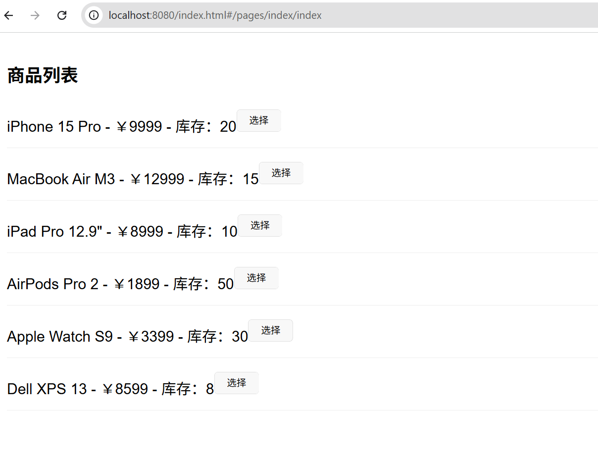
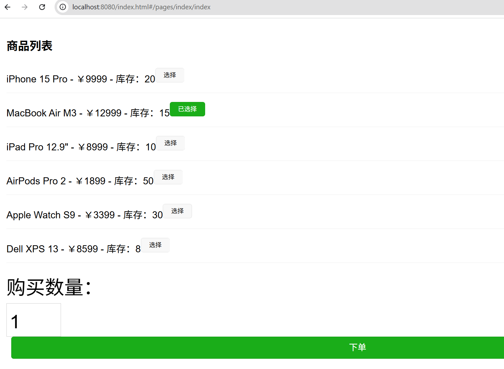
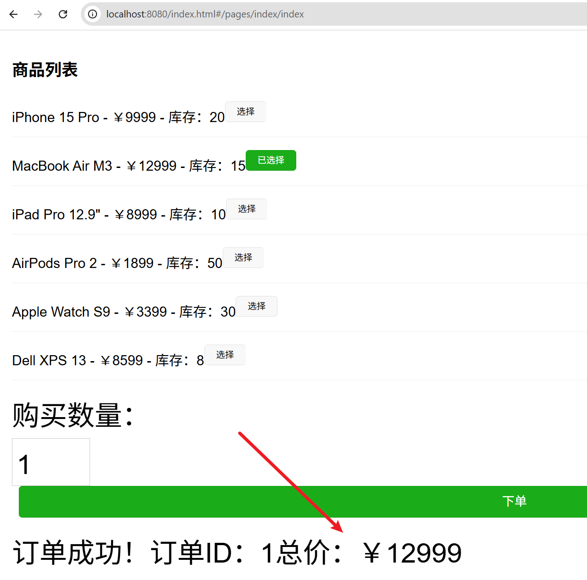

# 🛠️ E-Commerce Backend (Spring Boot)

这是一个使用 JAVA17 Spring Boot 3+ 构建的简易电商后端应用。使用内存存储实现商品展示和下单功能。

---

## 📦 技术栈

- Java 17+
- Spring Boot 3+
- Spring Web
- Mysql 8
- Redis 7.0.15

---

## 🚀 启动方式
启动类启动 DemoApplication
### 前提要求
- 开发工具 IDEA 2023
- 安装 Java 17+
- 安装 Maven 3.6+
- 安装 Mysql 8+
- 安装 Redis 7+
- 执行 resource/sql/index.sql (如果一次执行不成功可以单独执行每条SQL)
### 启动命令

### API 访问
#### springdoc-openapi Swagger  
http://localhost:8080/swagger-ui.html
# 或
http://localhost:8080/swagger-ui/index.html

## 服务地址
前端项目已经打包到静态目录，可以直接访问
http://localhost:8080/index.html

## 技术支持
1. 如果项目在启动过程中有任务问题，请留下comment或者发送邮件到hujun085258@gmail.com
2. 如果需要引入新技术技术比如springCloud,MQ,Docker等可以comment或者发送邮件到hujun085258@gmail.com
3. 如何你有新的需求comment或者发送邮件到hujun085258@gmail.com

## 声明
本项目作为面试的Demo产品请进行有效参考。

## 项目效果

